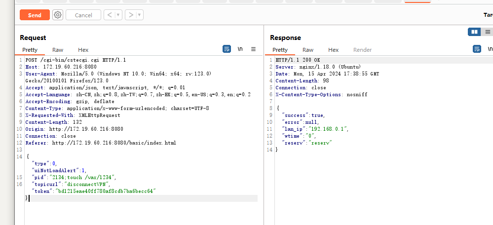
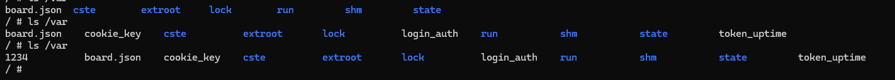

# TOTOLINK X5000R Command injection
##Firmware version：X5000R_V9.1.0cu.2350_B20230313
Problem function:sub_410B7C
```c
int __fastcall sub_410B7C(int a1)
{
  const char *Var; // $s1
  char v3[256]; // [sp+1Ch] [-114h] BYREF

  Var = (const char *)websGetVar(a1, "pid", 4357380);
  memset(v3, 0, sizeof(v3));
  snprintf(v3, 256, "kill %s", Var);
  CsteSystem(v3, 0);
  return sub_4037B8("0", "reserv");
}
```
When topicurl is set to disconnectVPN, it extracts the value of pid and executes it. Using a semicolon (;) can bypass restrictions and execute arbitrary shell commands.

File is created

